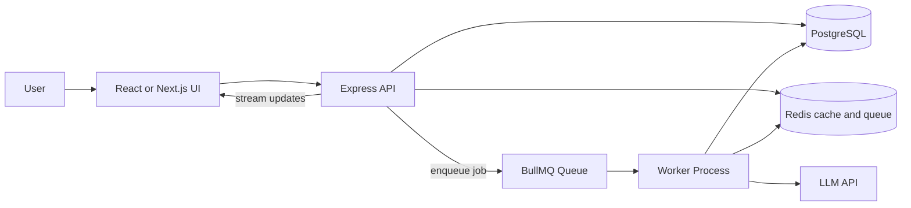

# Resume Analyzer (minimal scaffold)

This is a minimal scaffold for the AI Resume Analyzer project. It provides a simple Express server with a stubbed `/analyze` endpoint.

Quick start

Install dependencies:

```bash
npm install
```

Run the server:

```bash
npm start
```

Example request:

```bash
curl -X POST http://localhost:3000/analyze \
  -H "Content-Type: application/json" \
  -d '{"resume":"Experienced software engineer...","job":"Backend engineer"}'
```

Next steps:

- Replace `src/llm.js` with a real LLM integration (OpenAI/Claude)
- Add persistence, caching, and background job processing
# AI Resume Analyzer

AI Resume Analyzer is a backend-focused learning project for understanding how production AI systems are built, scaled, and protected in the real world.

This is not just a resume app. It is a deliberate project for learning the backend engineering concepts that show up in production AI software:

- Caching
- Queues and background jobs
- Rate limiting
- Streaming AI responses
- Resume analysis pipelines
- Scaling AI inference
- Microservices basics

The goal is to build one focused system, then evolve it step by step so each improvement teaches a real engineering tradeoff.

## What This Project Does

Users can upload or paste a resume and optionally include a job description. The system analyzes the input and returns:

- Resume summary
- Strengths
- Weaknesses
- Missing keywords
- ATS-style feedback
- Job match score
- Suggested bullet improvements
- Interview questions based on the resume

## Recommended Stack

The stack below is optimized for learning production backend concepts clearly:

- Frontend: React or Next.js with a simple UI
- Backend: Node.js with Express
- Database: PostgreSQL for persisted analysis records
- Cache and queue: Redis
- Background jobs: BullMQ
- AI provider: OpenAI, Claude, or any LLM API

Why this stack:

- Express keeps the HTTP layer simple so the focus stays on architecture rather than framework magic.
- Redis can power caching, queues, and rate limiting in one project.
- BullMQ makes queue behavior and worker separation easy to observe.
- PostgreSQL gives a realistic place to store analysis history and job status.

## Learning Rule

Every major feature should be explained through the same lens:

1. What problem it solves
2. Why it is needed
3. What breaks without it
4. How it works in this project
5. How it is used in real AI and software systems

That rule keeps the project educational instead of becoming a pile of disconnected code.

## Roadmap

### Phase 1: Resume Analysis Pipeline

Build the core resume analysis flow.

Flow:

User submits resume -> Backend stores request -> Backend cleans resume text -> Backend extracts skills, education, experience, and projects -> Backend sends a structured prompt to the AI -> Backend saves the analysis result -> User receives the result

Teach this phase:

- Why this is a pipeline
- Why each stage should have a clear responsibility
- Why raw text should be cleaned before AI analysis
- How prompt structure affects output quality
- How to store analysis results

Deliverables:

- Resume submission endpoint
- Optional job description field
- Resume analysis table
- Processing status values: pending, processing, completed, failed
- Basic AI-generated resume feedback

### Phase 2: Queues and Background Jobs

Move resume analysis into a background job.

Flow:

User submits resume -> API creates analysis job -> Queue stores the job -> Worker picks the job -> Worker calls AI -> Database updates the result -> User checks status

Teach this phase:

- What a queue is
- What a worker is
- Why AI tasks should often run in the background
- What retry logic is
- What happens if the AI API fails
- Difference between synchronous and asynchronous processing

Deliverables:

- Redis running locally
- Queue setup
- Worker process
- Job retry configuration
- Failed job handling
- Endpoint to check analysis status

### Phase 3: Caching

Add caching for repeated resume analysis.

Example:

Same resume + same job description should not always call the AI again.

Flow:

User submits resume and job description -> Create hash/cache key -> Check Redis cache -> If cached, return stored analysis -> If not cached, run AI analysis -> Store result in cache

Teach this phase:

- What caching is
- Cache hit vs cache miss
- TTL
- Cache invalidation
- Why caching saves money in AI apps
- How to design a good cache key

Deliverables:

- Redis cache
- Resume + job description hash
- Cached analysis result
- Logs showing cache hit or miss
- Response time comparison

### Phase 4: Streaming Responses

Add streaming for AI analysis so the user sees feedback appear gradually instead of waiting for the full response.

Teach this phase:

- Why streaming improves user experience
- Difference between normal JSON response and streaming
- Server-Sent Events vs WebSockets
- Why AI apps use streaming

Deliverables:

- Streaming analysis endpoint
- Frontend that shows streamed feedback
- Explanation of how the connection stays open

### Phase 5: Rate Limiting

Protect the app from abuse and runaway cost.

Example:

A user or IP can only request 5 AI analyses per minute.

Teach this phase:

- Why rate limiting matters
- How it protects AI API cost
- How it prevents abuse
- Fixed window vs sliding window vs token bucket
- How Redis helps rate limiting

Deliverables:

- Rate limiter middleware
- Clear error message when the limit is exceeded
- Test by sending many requests quickly

### Phase 6: Scaling AI Inference

Simulate many resume analyses happening at the same time.

Teach this phase:

- Why one worker may not be enough
- How multiple workers process jobs from one queue
- What horizontal scaling means
- Why AI calls become bottlenecks
- How batching, caching, and queues help scaling

Deliverables:

- Run multiple workers locally
- Submit many analysis jobs
- Show jobs being distributed
- Explain what would change in production

### Phase 7: Microservices Basics

Do not fully rewrite into microservices unless necessary.

Instead, explain how the app could be split later into separate services:

- Resume API service
- AI analysis service
- Queue worker service
- Billing or usage service
- Notification service

Teach this phase:

- What microservices are
- Why companies use them
- Why microservices add complexity
- When a monolith is better
- How queues help services communicate

Deliverables:

- Simple architecture explanation
- Optional separation between API server and worker process
- Clear explanation of why this is not over-engineered

## Architecture At A Glance



## What Each Phase Should Teach

### Pipeline Thinking

A resume analysis request should be treated as a pipeline because each stage does one thing well.

This matters because production AI systems are rarely one giant call. They usually involve:

- Input validation
- Cleaning and normalization
- Extraction and structuring
- Prompt construction
- Model inference
- Result storage
- User-facing delivery

### Background Jobs

AI work is often too slow or too expensive to hold open inside a normal request lifecycle. Background jobs let the API respond quickly while work continues in the worker.

### Caching

Caching prevents repeated work when the same or similar analysis is requested more than once. In AI systems, this can reduce cost, lower latency, and protect downstream APIs.

### Streaming

Streaming makes the app feel responsive and gives users visible progress while the model is still generating output.

### Rate Limiting

Rate limiting protects the system from abuse, accidental overload, and unbounded AI spend.

### Scaling

Scaling becomes important when one queue and one worker are no longer enough. This project should show how the same design can support multiple workers without changing the API contract.

### Microservices Basics

Microservices are worth understanding, but they should be introduced as a possible future split, not the starting point. A monolith with clear boundaries is the right first version here.

## Data You Will Store

The database should keep enough information to support status tracking, retries, and analysis history.

Suggested records:

- User-submitted resume text
- Optional job description text
- Cleaned or extracted resume data
- Analysis result payload
- Status field: pending, processing, completed, failed
- Job or request identifiers
- Cache metadata if needed for debugging

## Resume Analysis Output

The final AI response should be structured enough to be useful and consistent. A good analysis result should include:

- Summary
- Strengths
- Weaknesses
- Missing keywords
- ATS feedback
- Job match score
- Improved bullet suggestions
- Interview questions

## Suggested Project Milestones

1. Build a basic submit-and-analyze flow.
2. Move analysis into a queue and worker.
3. Add Redis caching for repeated requests.
4. Stream results to the frontend.
5. Protect the API with rate limiting.
6. Run multiple workers and observe scaling behavior.
7. Document how the design could evolve into services.

## What You Should Be Able To Explain In An Interview

By the end of this project, you should be able to clearly answer:

- Why is the resume analysis flow a pipeline?
- Why should AI work often run in background jobs?
- What is the difference between a queue and a worker?
- When should cached analysis be reused?
- How do you design a cache key for resume plus job description?
- Why does streaming improve perceived performance?
- Why are Redis and queues useful in AI systems?
- What is the difference between synchronous and asynchronous processing?
- How does rate limiting protect cost and stability?
- Why might multiple workers be needed?
- When is a monolith better than microservices?
- How would you split this system later if needed?

## Final Deliverables

This project should eventually give you the raw material for:

1. A GitHub README
2. An architecture diagram
3. Resume bullet points
4. An interview explanation
5. A list of concepts learned
6. A list of questions you should be able to answer

## Project Intent

The point of AI Resume Analyzer is not to overbuild an application. The point is to build a realistic, educational backend system that makes production AI concepts concrete.

If the project stays focused, it will be a strong portfolio piece and a better interview story than a larger but less intentional app.
